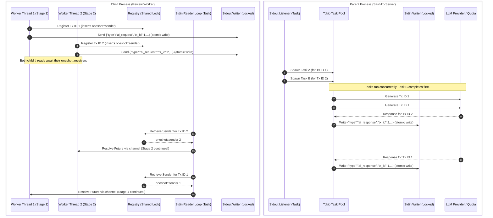

# Design Document: Multiplexed Concurrent AI IPC Protocol

## 1. Objective

Sashiko's review pipeline parallelizes stages 1-7 in the child worker process. However, when executing inside the server, these requests are serialized at the IPC (Inter-Process Communication) transport layer due to the sequential stdout/stdin reading loops and the lack of message correlation identifiers.

This design outlines a robust, **multiplexed concurrent IPC protocol** over standard streams (stdio) that enables concurrent LLM execution while providing **strong consistency guarantees**. Under no circumstances will requests or responses be intermixed, cross-routed, or misattributed.

---

## 2. Design Principles & Consistency Guarantees

To prevent silent data corruption (such as Stage A receiving the analysis output meant for Stage B), the design enforces the following strict invariants:

1.  **Unique Monotonic Transaction IDs:**
    Every AI request emitted by the child must be enveloped with a unique, thread-safe, monotonically increasing transaction identifier (`tx_id`).
2.  **Response Mirroring & Attestation:**
    The parent must mirror the `tx_id` in its response envelope. The child must only consume a response if its `tx_id` matches an active, registered request.
3.  **Crash-on-Violation (Fail Fast):**
    If a message is received with an unregistered, duplicate, or malformed `tx_id`, both the child and parent processes must immediately abort (panic/exit) rather than risk cross-routing or state leakage.
4.  **Atomic Line Writes (Anti-Interleaving):**
    Standard streams are byte-oriented. If concurrent threads write partial JSON blocks to the same stream, they can interleave, causing parsing failures. All writes to the IPC pipes must be strictly serialized using a synchronized, thread-safe writer wrapper.

---

## 3. Protocol Envelope Specifications

We extend the NDJSON (Newline-Delimited JSON) protocol. All envelopes must be serialized to a **single line** terminated by `\n`.

### 3.1. AI Request Envelope (Child -> Parent)
```json
{
  "type": "ai_request",
  "tx_id": 1,
  "payload": {
    "system": "Optional system instructions...",
    "messages": [
      { "role": "user", "content": "..." }
    ],
    "tools": [ ... ],
    "temperature": 1.0,
    "context_tag": "[ps:123 p:1 s:4]"
  }
}
```

### 3.2. AI Response Envelope (Parent -> Child)
```json
{
  "type": "ai_response",
  "tx_id": 1,
  "payload": {
    "content": "...",
    "thought": "...",
    "tool_calls": [ ... ],
    "usage": {
      "prompt_tokens": 100,
      "completion_tokens": 50
    }
  }
}
```

### 3.3. Error Envelope (Parent -> Child)
If a transient or fatal error occurs, the parent mirrors the `tx_id` so the correct child thread can receive and handle the error context.
```json
{
  "type": "error",
  "tx_id": 1,
  "payload": {
    "message": "Rate limit exceeded",
    "class": "rate_limit",
    "retry_after_secs": 30
  }
}
```

---

## 4. Process Architecture & Multiplexing Data Flow



---

## 5. Detailed Implementation Specs

### 5.1. Child Process: IPC Registry & Transport

To coordinate multiple concurrent futures awaiting their respective responses, the child's stdio client (`StdioGeminiClient` and `StdioClaudeClient`) will share an `Arc<IpcRegistry>`:

```rust
use std::collections::HashMap;
use tokio::sync::{oneshot, Mutex};

type ResponseChannel = oneshot::Sender<Result<AiResponse, RemoteAiError>>;

pub struct IpcRegistry {
    // Monotonically increasing atomic ID
    next_tx_id: std::sync::atomic::AtomicU64,
    // Map of active transactions awaiting responses
    pending: Mutex<HashMap<u64, ResponseChannel>>,
}

impl IpcRegistry {
    pub fn next_id(&self) -> u64 {
        self.next_tx_id.fetch_add(1, std::sync::atomic::Ordering::SeqCst)
    }
    
    pub async fn register(&self, tx_id: u64, tx: ResponseChannel) {
        let mut map = self.pending.lock().await;
        if map.insert(tx_id, tx).is_some() {
            // Strong Consistency Check: Duplicate ID detection triggers immediate exit
            eprintln!("CRITICAL PROTOCOL ERROR: Duplicate transaction ID {} registered!", tx_id);
            std::process::exit(1);
        }
    }
    
    pub async fn dispatch(&self, tx_id: u64, result: Result<AiResponse, RemoteAiError>) {
        let mut map = self.pending.lock().await;
        if let Some(sender) = map.remove(&tx_id) {
            let _ = sender.send(result);
        } else {
            // Strong Consistency Check: Unsolicited response triggers immediate exit
            eprintln!("CRITICAL PROTOCOL ERROR: Unsolicited response received for tx_id: {}!", tx_id);
            std::process::exit(1);
        }
    }
}
```

#### Background Stdin Reader Loop (Child)
On initialization, the child spawns a single tokio task that runs continuously:
```rust
async fn start_stdin_reader(registry: Arc<IpcRegistry>) {
    use tokio::io::{AsyncBufReadExt, BufReader};
    let stdin = tokio::io::stdin();
    let reader = BufReader::new(stdin);
    let mut lines = reader.lines();

    while let Ok(Some(line)) = lines.next_line().await {
        if let Ok(envelope) = serde_json::from_str::<IncomingEnvelope>(&line) {
            match envelope {
                IncomingEnvelope::Response { tx_id, payload } => {
                    registry.dispatch(tx_id, Ok(payload)).await;
                }
                IncomingEnvelope::Error { tx_id, payload } => {
                    registry.dispatch(tx_id, Err(payload)).await;
                }
            }
        } else {
            eprintln!("CRITICAL PROTOCOL ERROR: Received malformed JSON on stdin: {}", line);
            std::process::exit(1);
        }
    }
}
```

#### Atomic Line Writer (Child)
Writing to `stdout` must be protected by an `Arc<Mutex<Stdout>>` or utilizing an `mpsc::Sender` to a single writer loop to prevent interleaving bytes from multiple worker threads.
```rust
pub struct AtomicWriter {
    writer: Mutex<tokio::io::Stdout>,
}

impl AtomicWriter {
    pub async fn write_line(&self, line: &str) -> Result<()> {
        use tokio::io::AsyncWriteExt;
        let mut lock = self.writer.lock().await;
        lock.write_all(line.as_bytes()).await?;
        lock.write_all(b"\n").await?;
        lock.flush().await?;
        Ok(())
    }
}
```

---

### 5.2. Parent Process: Concurrent Orchestration & Atomic Stdin Writing

In [src/reviewer.rs:run_review_tool](file:///usr/local/google/home/kfree/sashiko_deploy/src/reviewer.rs#L1456), instead of blocking on `generate_content` sequentially inside the loop, the parent will:

1.  Maintain an `Arc<Mutex<StdinWriter>>` to allow thread-safe, atomic writes to the child's `stdin`.
2.  Continuously read lines from `stdout`.
3.  For each `"ai_request"`, immediately extract the `tx_id` and spawn a new tokio task:

```rust
let stdin_writer = Arc::new(Mutex::new(stdin)); // Async writer wrap

while let Ok(Some(line)) = lines.next_line().await {
    if let Ok(json_msg) = serde_json::from_str::<Value>(&line) {
        if let Some("ai_request") = json_msg.get("type").and_then(|v| v.as_str()) {
            let tx_id = json_msg["tx_id"].as_u64().expect("Missing tx_id in request");
            let payload = json_msg["payload"].clone();
            
            // Centralized telemetry and async provider resources
            let db_clone = db.clone();
            let provider_clone = provider.clone();
            let quota_clone = quota_manager.clone();
            let settings_clone = settings.clone();
            let stdin_clone = stdin_writer.clone();
            let review_id = review_id;

            tokio::spawn(async move {
                let req: AiRequest = serde_json::from_value(payload).unwrap();
                
                // Perform rate-limiting queue check
                let _ = quota_clone.wait_for_access().await;
                
                let response_result = provider_clone.generate_content(req).await;
                
                let envelope = match response_result {
                    Ok(resp) => {
                        // Write DB telemetry concurrently (safe since SQLite WAL handles lock retries)
                        log_telemetry(&db_clone, review_id, &resp).await;
                        
                        json!({
                            "type": "ai_response",
                            "tx_id": tx_id,
                            "payload": resp
                        })
                    }
                    Err(e) => {
                        let err_class = classify_ai_error(&e);
                        json!({
                            "type": "error",
                            "tx_id": tx_id,
                            "payload": {
                                "message": e.to_string(),
                                "class": format!("{:?}", err_class).to_lowercase()
                            }
                        })
                    }
                };

                // Write atomic response line to child's stdin
                let mut line_str = serde_json::to_string(&envelope).unwrap();
                line_str.push('\n');
                
                let mut writer_lock = stdin_clone.lock().await;
                let _ = writer_lock.write_all(line_str.as_bytes()).await;
                let _ = writer_lock.flush().await;
            });
        }
    }
}
```

---

## 6. Verification & Safety Guarantees

- **Zero Cross-Routing:** The mapping between `tx_id` and `oneshot::Channel` inside the child's `IpcRegistry` prevents any thread from reading data not intended for it. 
- **Atomic Framing:** Wrapping the low-level handles in async `Mutex` guards guarantees that lines are completely flushed without byte-level interleaving, ensuring 100% parse rate of JSON strings on both ends.
- **Strict Telemetry Safety:** Telemetry logging calls are moved to individual concurrent tasks in the parent, safely decoupled from the main coordination loop.

---

## 7. Execution Plan

1.  **Phase 1: Child Codebase Refactoring**
    - Define envelope types (`IncomingEnvelope`, `OutgoingEnvelope`).
    - Implement `IpcRegistry` and `AtomicWriter` in `src/ai/mod.rs`.
    - Refactor `StdioGeminiClient` and `StdioClaudeClient` to register `tx_id`s, launch the background reader thread, and write requests atomically.
2.  **Phase 2: Parent Codebase Refactoring**
    - Update `src/reviewer.rs` to wrap `stdin` in `Arc<Mutex<...>>`.
    - Modify the main `stdout` line-processing loop to spawn independent tokio tasks for each `ai_request` using the matched `tx_id`.
3.  **Phase 3: Testing & Validation**
    - Run unit tests (`make test`).
    - Run integration/smoke tests (`make integration-test`) to ensure multiple stages can review concurrently without any failures or cross-routed responses.
    - Run the benchmark suite (`make check-all`) to verify substantial reduction in review durations.
